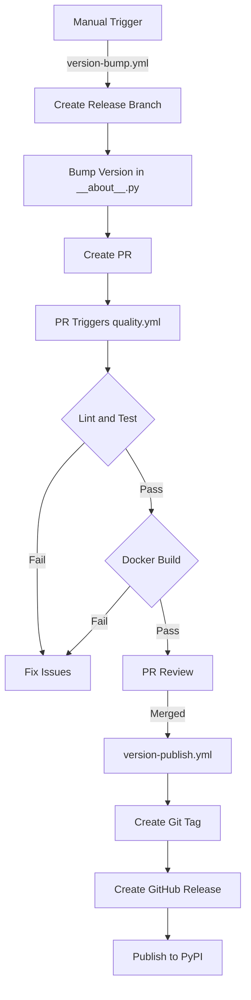
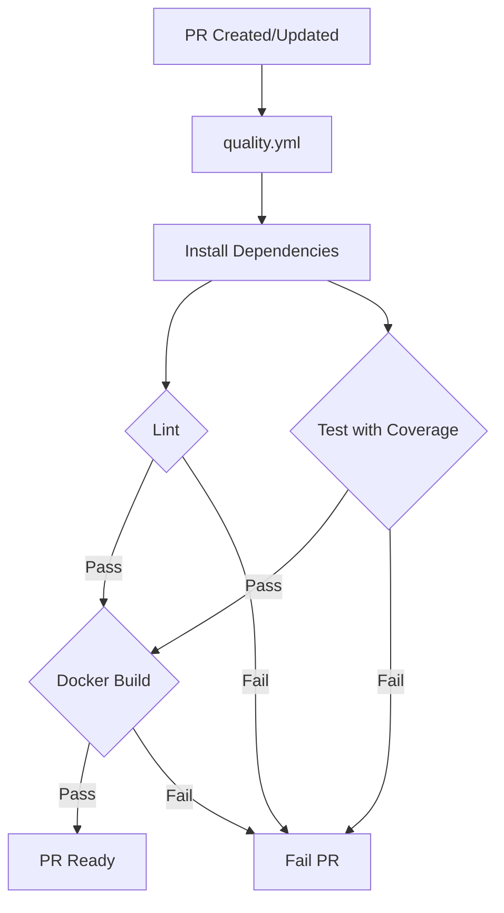
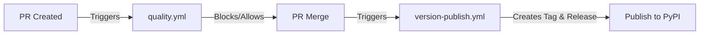

# 🚀 GitHub Workflows Documentation

This directory contains the GitHub Actions workflows for the gOdoo-cli project. Below are the flowcharts explaining the different processes.

## 📈 Version Management Process

## 🔍 Quality Check Process

## 🔄 Workflow Overview

## 💾 Caching Strategy

To optimize the workflow execution time, we leverage caching for the following:

- 📦 **Python dependencies**: The `actions/setup-python` action is used with the `cache: "pip"` option to cache Python packages. The cache key is based on the `pyproject.toml` file.
- 🔧 **Pre-commit hooks**: The `.pre-commit-config.yaml` file is used as the cache key for pre-commit hooks.

This multi-level caching strategy ensures that workflows run efficiently while still maintaining cache freshness and relevance.

## 📋 Workflow Details

### 🔼 version-bump.yml
- **Trigger**: Manual workflow dispatch
- **Options**: patch, minor, major, alpha, beta, rc
- **Actions**:
  1. Creates release branch
  2. Updates version using Hatch
  3. Creates PR with version bump

### ✅ quality.yml
- **Trigger**: Pull request events, push to main, manual dispatch
- **Actions**:
  1. Runs linting suite
  2. Runs tests with coverage
  3. Builds Docker image
- **Status**: Required check for PR merge

### 📦 version-publish.yml
- **Trigger**: PR merged with 'release' label
- **Actions**:
  1. Creates Git tag
  2. Creates GitHub release
  3. Builds Python package
  4. Publishes to PyPI

## 📝 Notes
- ⚙️ Quality checks run automatically on PR creation/update
- 🔢 Version bumps are initiated manually
- 🚀 Release process is automated after PR merge
- 🔒 All steps have appropriate permissions and concurrency limits
