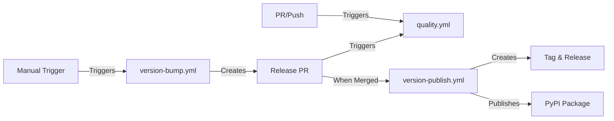
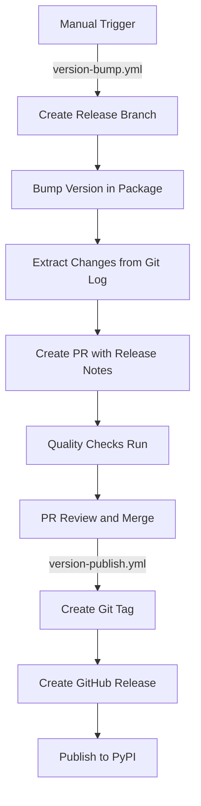

# 🔄 GitHub Workflows

This directory contains the GitHub Actions workflows for the gOdoo project.

## 📊 Workflow Overview

## 📋 Workflow Details

### ✅ quality.yml
- **Triggers**: PR events, push to main, manual dispatch
- **Actions**:
  - Runs on Python 3.9, 3.11, and 3.12 matrix
  - Executes formatter and linters with Hatch
  - Runs tests with coverage reporting to Codecov
  - Builds Docker image on main branch pushes
  - Uses BuildX caching for efficient Docker builds

### 🔢 version-bump.yml
- **Trigger**: Manual workflow dispatch
- **Inputs**: patch, minor, major, alpha, beta, rc
- **Actions**:
  - Gets current version using Hatch
  - Bumps version according to input type
  - Creates release branch
  - Generates commit history as release notes
  - Opens PR with release notes and proper labels

### 📦 version-publish.yml
- **Trigger**: Merged PR with 'release' label
- **Actions**:
  - Verifies proper merge state
  - Creates Git tag with version from Hatch
  - Creates GitHub release (prerelease for alpha/beta/rc)
  - Builds package with Hatch
  - Publishes to PyPI using token authentication

## 🔧 Implementation Details

### Python Environment
- Uses `actions/setup-python@v5` with Hatch for dependency management
- Handles version bumping through Hatch's versioning tools
- Runs quality checks in consistent environments

### Docker Building
- Uses Docker BuildX with layer caching
- Publishes to GitHub Container Registry
- Optimized cache handling to speed up builds

### CI Optimizations
- Concurrency controls to cancel redundant workflow runs
- Shallow clones when appropriate
- Strategic caching of dependencies and build artifacts

## 📝 Automated Processes

## 🔑 Key Points
- ✅ Quality checks run automatically on every PR and push to main
- 🔖 Version bumping requires manual trigger by maintainers
- 🚀 Release publishing is automated after PR merge
- 🔒 Secure token handling for PyPI publishing
- 🐳 Docker images use multi-stage builds for optimization
