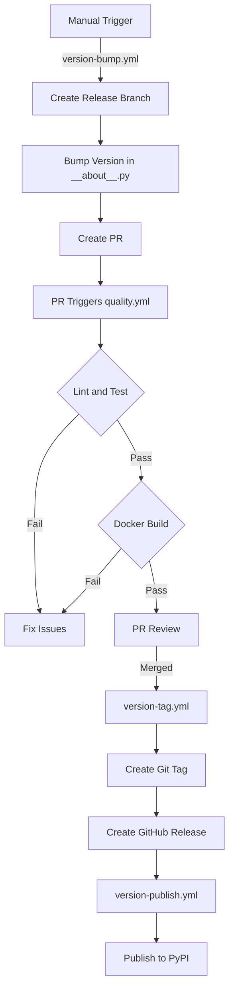
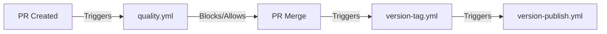

# GitHub Workflows Documentation

This directory contains the GitHub Actions workflows for the gOdoo-cli project. Below are the flowcharts explaining the different processes.

## Version Management Process

## Quality Check Process

## Workflow Overview

## Caching Strategy

The workflows employ caching at two levels:

1. **Python Dependencies**:
   - Caches are created based on  `pyproject.toml` and `__manifest__.py`
   - This ensures that the cache is invalidated whenever dependencies change
   - Speeds up the installation process significantly

2. **Docker Layers**:
   - The Docker build process uses BuildKit's caching mechanism
   - Layers are cached and reused across builds
   - The cache is tied to the commit SHA to ensure maximum relevance
   - Unused caches are automatically pruned to save space

This multi-level caching strategy ensures that workflows run efficiently while still maintaining cache freshness and relevance.

## Workflow Details

### version-bump.yml
- **Trigger**: Manual workflow dispatch
- **Options**: patch, minor, major, prepatch
- **Actions**:
  1. Creates release branch
  2. Updates version using Hatch
  3. Creates PR with version bump

### quality.yml
- **Trigger**: Pull request events
- **Actions**:
  1. Runs linting suite
  2. Runs tests with coverage
  3. Builds Docker image
- **Status**: Required check for PR merge

### version-tag.yml
- **Trigger**: PR merged with 'release' label
- **Actions**:
  1. Creates Git tag
  2. Creates GitHub release
  3. Triggers publish workflow

### version-publish.yml
- **Trigger**: Release created
- **Actions**:
  1. Builds Python package
  2. Publishes to PyPI

## Notes
- Quality checks run automatically on PR creation/update
- Version bumps are initiated manually
- Release process is automated after PR merge
- All steps have appropriate permissions and concurrency limits
