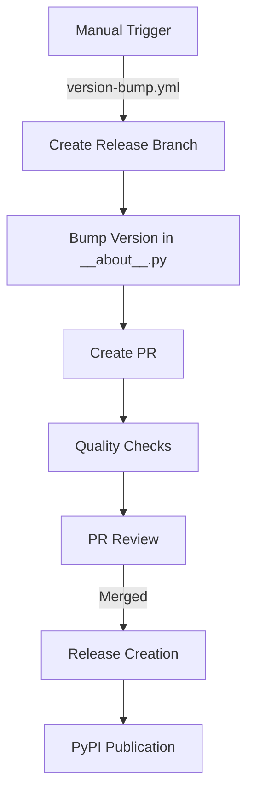

# gOdoo Dev Environment


[](image.png)

**gOdoo** is short for **go Odoo**. \
It is a [Vscode Devcontainer](https://code.visualstudio.com/docs/remote/containers) Environment for [Odoo](https://odoo.com/)
with Python CLI `godoo` convenience wrapper around `odoo-bin`.

This repository is the base source for the Python package [godoo-cli](https://pypi.org/project/godoo-cli/) and serves as
an all batteries included development environment.

This is the source repository for `gOdoo`. If you want to use `gOdoo` please refer to [./docker/Dockerfile](./docker/Dockerfile) and modify it to install godoo using Pip.

Made Possible by: [WEMPE Elektronic GmbH](https://wetech.de)

# gOdoo-cli

Python package that provides `godoo` command line interface around `odoo-bin`.

It's build with [Typer](https://github.com/tiangolo/typer) to provide some convenience Wrappers for Odoo development and
Deployment.

Most flags can be configured by Env variables. \
Use `godoo --help` to find out more. HINT: Install tab-completion with `godoo --install-completion`

# Docker

For deployment and runtime-state orchestration, see the [runtime lifecycle CLI
reference](docs/lifecycle.md). It documents the canonical `godoo runtime …`
surface, the current compatibility aliases, storage safety rules, and a Compose
init/app pattern.

This workspace also contains Docker and Docker-Compose files. \

They are used to provide either easy Odoo instances where the source is pulled according to
[ODOO_MANIFEST.yml](odoo_manifest.yml), or as a all batteries included devcontainer for VScode.

## Requirements

- [Docker Compose](https://github.com/docker/compose)
- [Traefik](https://doc.traefik.io/traefik/) container running with docker provider and "traefik" named docker network.
  Example: [Traefik Devproxy](https://github.com/joshkreud/traefik_devproxy)
- SSH Agent running. (check `echo $SSH_AUTH_SOCK`)\
  This gets passed trough in the Buildprocess to clone Thirdparty repos (Optional).

## Just wanna have a quick and easy Odoo Instance?

```bash
git clone https://github.com/OpenJKSoftware/gOdoo
cd godoo
. scripts/container_requirements.sh # Check Requirements
docker-compose build
docker-compose up
# wait......
# wait a bit mode ...
# just a little bit longer ..
# There we go.
# Odoo should be reachable on 'https://godoo.docker.localhost' assuming you didn't change .env TRAEFIK_HOST_RULE or COMPOSE_PROJECT_NAME
```

# Devcontainer

## Features

- All batteries included [Devcontainer](https://code.visualstudio.com/docs/remote/containers) with postgres service
  Container and local DNS resolvig managed by [Traefik](https://doc.traefik.io/traefik/).
- Easy fully working Odoo instance by `docker-compose up` with https access.
- `godoo` CLI wrapper around Odoo. (Most flags can be configured by Environment Variables and are already preconfigured
  in the Containers. See [.env.sample](./.env.sample))
- Cups Container, that provides a CUPS Printserver
- `odoo-bin` is added to PATH and can thus be invoked from every folder.
- Odoo will run in Proxy_Mode behind a Traefik reverse proxy for easy access on
  `https://$COMPOSE_PROJECT_NAME.docker.localhost`
- [Odoo Pylint plugin](https://github.com/OCA/pylint-odoo) preconfigured in vscode
- Preinstalled vscode Extensions Highlights:
  - [SQL Tools](https://marketplace.visualstudio.com/items?itemName=mtxr.sqltools) with preconfigured connection for
    easy Database access in the Sidebar.
  - [Docker Extension](https://marketplace.visualstudio.com/items?itemName=ms-azuretools.vscode-docker) controls
    container host.
  - [Odoo Snippets](https://marketplace.visualstudio.com/items?itemName=mstuttgart.odoo-snippets)
  - [Odoo Developments](https://marketplace.visualstudio.com/items?itemName=scapigliato.vsc-odoo-development) can Grab
    Odoo Model information from a running Server
  - [Todo Tree](https://marketplace.visualstudio.com/items?itemName=Gruntfuggly.todo-tree)

## Usage

1. For Docker on windows: Clone the repo into the WSL2 Filesystem for better IO performance
2. Have [Traefik](https://github.com/traefik/traefik) Running on `docker.localhost`
   [Example](https://github.com/joshkreud/traefik_devproxy) \
   There must be a Docker network called `traefik` that can reach traefik.
3. Open Devcontianer:
   - If you have the Devcontainer CLI: `devcontainer open .`
   - If not open the workspace in Local Vscode. In the Command pallete search for `Reopen in container`
4. From **within the container** start Odoo using one of the following commands:
   - You can enable godoo tab-completion by `godoo --install-completion`
   - `make` / `make dev` -> Prepares the runtime, initializes a missing DB, then starts Odoo with workspace addons and demo data.
   - `make bare` -> Prepares, initializes, and starts Odoo without installing workspace modules.
   - `make prepare` -> Synchronizes declared source repositories and prepares configuration and Python dependencies; it does not touch the database or start Odoo.
   - `make bootstrap` -> Prepares and initializes a missing database; it does not start Odoo.
   - `make launch` (or `make quick`) -> Starts an existing runtime in development mode. It never initializes or upgrades a database.
   - `make offline` -> Runs the full lifecycle without synchronizing source repositories.
   - `make kill` -> Search for `odoo-bin` processes and kill them
   - `godoo reset --empty` -> Drops the configured DB and its filestore
   - The full init script is available via "`godoo`". (See --help for Options)
5. Open Odoo `https://$COMPOSE_PROJECT_NAME.docker.localhost`\
   For example `COMPOSE_PROJECT_NAME=godoo` --> [https://godoo.docker.localhost](https://godoo.docker.localhost)
6. Login with `admin:admin`
7. Profit!

gOdoo supports **Odoo 19 and newer**. `godoo dev` owns the DevContainer
lifecycle: it optionally synchronizes source, prepares configuration and
dependencies, asks Odoo to initialize only a missing runtime, runs the explicit
DevContainer post-bootstrap hooks, and launches Odoo. `godoo launch` only
starts an existing runtime. `scripts/launchodoo.sh` is a thin container adapter
with `--prepare-only`, `--bootstrap-only`, and `--launch-only` modes. Staging
password, `report.url`, and migration changes run only after a newly initialized
database.

Run tests with `godoo test run all` or `godoo test run changes:origin/main`.
Tests remain single-threaded and use Odoo's `--test-tags`, `--test-file`, and
`--stop-after-init` options.

For database lifecycle operations, Odoo 19 remains the source of truth.
`godoo reset --db-template <db>_template` replaces the runtime database and
filestore from a template; `godoo reset --empty` removes both. For a durable
baseline, use `godoo db dump`/`godoo db load --force` with an archive outside
the disposable Compose volumes. Dump/load needs temporary free space in
addition to the live data and archive. The default PostgreSQL 18 stack enables
`file_copy_method = clone`; `godoo db duplicate-cow` is explicit, requires
strict reflink support for both volumes, and never falls back to a full copy.
See [the CoW workflow](docs/cow.md).

### Deployment lifecycle

For a Compose-style deployment, keep initialization separate from the web
process. `godoo runtime init` exits after it has prepared the runtime; the app
service should run only `godoo runtime launch` after that job succeeds. See the
[runtime lifecycle CLI reference](docs/lifecycle.md) for the full command
reference, state matrix, hook ordering, storage commands, and legacy aliases.

```yaml
services:
  runtime-init:
    command: godoo runtime init --update my_module
  app:
    depends_on:
      runtime-init:
        condition: service_completed_successfully
    command: godoo runtime launch
```

An Odoo runtime is one PostgreSQL database and its matching filestore. With a
missing or empty runtime, `runtime init` either asks `odoo-bin` to bootstrap it
or consumes an explicitly configured Odoo archive before reconciling requested
`--update` and `--install` module lists:

```bash
godoo runtime init --seed /seed/runtime.zip --update my_module
godoo runtime reconcile --sync-sources --update my_module
```

`--seed` (or `GODOO_RUNTIME_SEED`) accepts Odoo's native filestore-aware ZIP or
the legacy `odoo.dump` plus `odoo_filestore` directory. A ready runtime is never
replaced by `runtime init`: a configured seed is logged and skipped, then the
existing runtime is reconciled. `--seed-archive` and `GODOO_SEED_ARCHIVE` remain
deprecated aliases.
This makes the init operation safe to repeat while keeping replacement
explicit.

`godoo db load --force` accepts both Odoo ZIP archives and the directory
format generated by gOdoo 0.17: `odoo.dump` plus `odoo_filestore`. For the
legacy directory format it restores only the selected runtime's filestore; if
the snapshot contains several filestores, use the original database name so
the selection is unambiguous. Use `godoo runtime storage archive load --force`
when deliberate replacement of a ready runtime is intended.

#### Lifecycle phase hooks

`godoo runtime init` can run application-specific Python snippets after
bootstrap, restore, and reconciliation. Configure repeatable directories with
`--after-bootstrap-dir`, `--after-restore-dir`, or `--after-reconcile-dir` and
the corresponding plural `GODOO_AFTER_*_DIRS` environment variable. The
after-reconcile option is also available on `godoo runtime reconcile`.

For example:

```bash
export GODOO_AFTER_RECONCILE_DIRS=/opt/odoo/hooks/common

godoo runtime init --update my_module
godoo runtime launch
```

Directories run in supplied order and are read non-recursively. Their `*.py`
files run in lexical filename order, so names such as `10_company.py` and
`20_settings.py` make dependencies visible. Every file is a separate `odoo-bin shell` invocation with the normal
Odoo shell variables, including the superuser `env`:

```python
# /opt/odoo/hooks/pre-launch/10_company.py
env.company.write({"name": "Example Ltd"})
env.cr.commit()
```

Odoo shell rolls back its open transaction when it exits, so a mutating hook
must call `env.cr.commit()` itself. A missing configured directory, an uncaught
exception, or a non-zero hook result fails that init attempt and prevents later
hooks from running. Commits made by earlier scripts are not rolled back. The
whole directory runs again on the next init attempt, including for an existing
ready runtime, so hooks must be idempotent.

The exact order is:

- New runtime: bootstrap -> after-bootstrap hooks -> reconcile -> after-reconcile hooks.
- Seeded runtime: restore -> after-restore hooks -> reconcile -> after-reconcile hooks.
- Existing ready runtime: skip any configured seed -> reconcile -> after-reconcile hooks.

These are lifecycle phase hooks, not hooks inside `runtime launch`.
`godoo runtime launch` remains a thin, start-only wrapper around `odoo-bin` and
never prepares, restores, bootstraps, reconciles, or runs hook scripts. In
Compose, keep `runtime init` in a one-shot service and start the app service only
after it succeeds. Hook content is downstream application policy; gOdoo only
provides lifecycle ordering and the Odoo-shell execution mechanism.

All lifecycle defaults have environment-variable equivalents shown in
`godoo runtime init --help`; source sync, dependency resolution, module actions,
and all destructive replacement remain explicit.

### Access to Odoo and Thirdparty addon Source

You can access the Odoo source by opening the VsCode workspace [full.code-workspace](full.code-workspace) from within
the Container. This will open a [Multi-Root Workspace](https://code.visualstudio.com/docs/editor/multi-root-workspaces).
Really waiting for https://github.com/microsoft/vscode-remote-release/issues/3665 here.

## Reset Devcontainer Data

When you screwed up so bad its time to just start Over godoo has you covered:

### Automatic Reset

There are 3 Options to reset the Dev Env.

1. From **Outside** the Container run `make reset-container` in the project root to delete docker volumes and restart the
   container. (Vscode will prompt to reconnect if still open)
2. From **Outside** the Container run `make reset-container-hard` in the project root to force rebuild the main Odoo container and
   then do the same as `make reset-container`
3. From **Inside** the Container run `godoo reset --empty` to drop the configured DB and filestore, which is way
   quicker than the other options.

### Manual Reset

1. Close vscode
2. Remove `app` and `db` container from docker.
3. Remove volumes: `db, odoo_thirdparty, odoo_web, vscode_extensions`
4. Restart Devcontainer

## Python Debugging

### VsCode Debugging

Debugging doesn't reliably work with
[Odoo Multiprocess](https://www.odoo.com/documentation/19.0/developer/reference/cli.html#multiprocessing) mode
enabled. \
The container ships with a Vscode Debug profile, that sets `--workers 0` to allow for Debugging Breakpoints. See [.vscode/launch.json](./.vscode/launch.json)

### Interactive Shell

Use `godoo shell` to enter an interactive shell on the Database.

# 🚀 CI/CD Pipeline

gOdoo uses GitHub Actions workflows for quality assurance and release management. The complete workflow documentation is available in the [.github/workflows/README.md](./.github/workflows/README.md) file.

## ✅ Quality Checks

Every pull request and push to main triggers automated quality checks:

- Linting and formatting with the latest Python tools
- Test execution with full coverage reports
- Docker image builds for verification

## 🔖 Version Management

The project uses a structured version management process:



## 📦 Release Process

1. A maintainer triggers a version bump (patch/minor/major/pre-release)
2. A pull request is automatically created with version changes
3. After CI passes and approval, the PR is merged
4. An automated process creates the GitHub release and publishes to PyPI

# Odoo Modules

## Third Party Modules (manifest.yml)

The `godoo` bootstrap function, will download some modules using git. \
Which Repos to download is specified in `ODOO_MANIFEST.yml` ([Default](odoo_manifest.yml)) \
Not all of the cloned addons are automatically installed. \
Install them via the Apps Page in Odoo using `godoo rpc modules install` or using `odoo-bin`.\
Modules downloaded on the Odoo Marketplace can be dropped as a `.zip` archive in [./thirdparty](./thirdparty)
