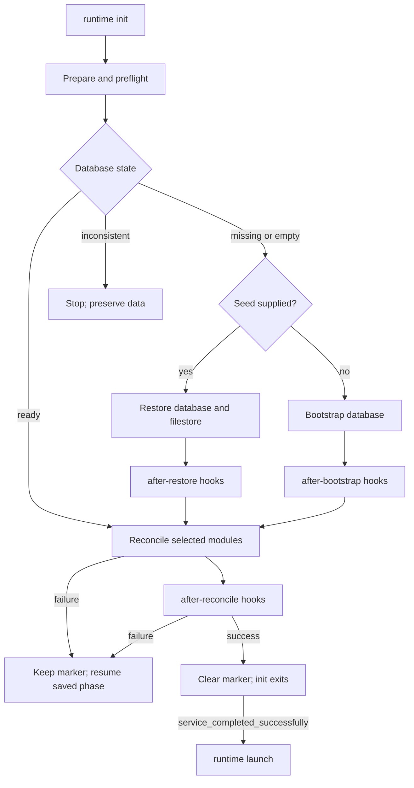
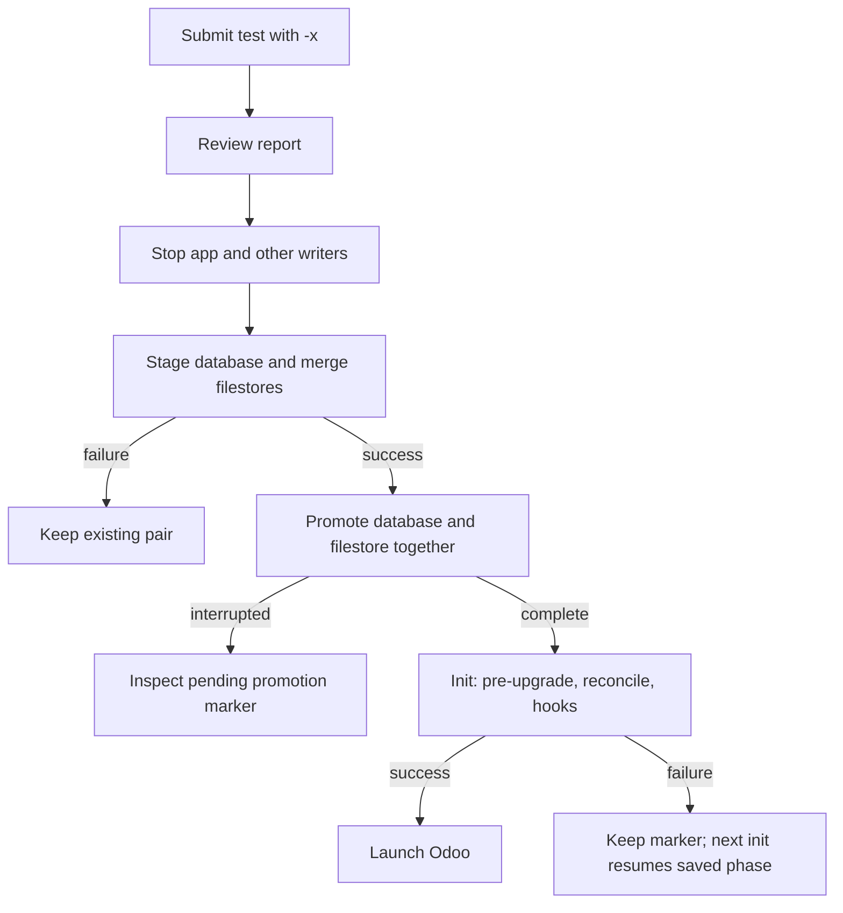

# Runtime lifecycle

A runtime is one PostgreSQL database and its matching filestore. Stop ordinary Odoo writers before initialization,
restore, clone, or replacement; gOdoo locks coordinate gOdoo operations only.

- Configuration precedence: CLI, exported environment, project `.env`. A Compose database target remains the target.
- `runtime init` prepares and reconciles once, then exits. `runtime launch` starts Odoo after init succeeds.
- Seed archives apply only to missing or empty databases; they never replace a ready database.
- A missing or empty database with a nonempty filestore is inconsistent and needs matching-pair recovery.



## Initialize and launch

```bash
# Run against the downstream project's configured database.
godoo runtime init \
  && godoo runtime launch
```

- Launch does not write configuration or database state; it checks the Odoo version and process dependencies.
- Runtime commands require Odoo 16 or newer, with no upper-version limit. Archive commands default to native Odoo
  commands on 19 or newer and PostgreSQL tools on 16–18; restore options may require SQL staging.
- `runtime status` is read-only. `runtime shell` and `runtime shell-script` start explicit Odoo shell sessions.
- `--update` and `--install` select module reconciliation. `--report-url` or `GODOO_REPORT_URL` sets Odoo's `report.url`
  after successful init; it is required when `--x-sendfile` or `GODOO_X_SENDFILE` is enabled.
- Hook directories run in configured order; each directory's `*.py` files run lexically, one Odoo shell session per
  file. Phases are at-least-once, so scripts must be safe to rerun. Contents may change at a selected path.

## Official and major-version upgrades

`godoo upgrade` fetches Odoo's official client and forwards its arguments.

- Operations: `test`, `production`, `restore`, `status`, `log`, and `wipe`.
- The wrapper does not add `-x`; pass it to keep a test result from restoring locally. Review the report before restore.
- Use `production` only when the upgrade is ready.

```bash
# Submit for testing; -x keeps the result out of the local runtime.
godoo upgrade test -i ORIGINAL_DUMP -t 19.0 -c CONTRACT -x
```

- `--original-filestore` must name the source database directory, such as `ODOO_DUMP_VARLIB_FOLDER/filestore/SOURCE_DB`;
  do not pass its parent or another nested `filestore/<database>` path.
- gOdoo copies original files to staging, then overlays archive files. Original-only files remain; ZIP files replace
  collisions. Staged files are independent regular files, using filesystem cloning when available and copy otherwise.
- Archive and source-tree checks happen before database mutation. Without this option, normal ZIP restore behavior is
  unchanged.

The option or `GODOO_ORIGINAL_FILESTORE` works with `godoo db load`, `godoo db prepare`, and
`godoo runtime init --seed`.

An initialized database from an older Odoo major fails the runtime-version guard before preparation or reconciliation;
`--seed` cannot replace it. Stop the app and other database writers, then load the upgraded pair and initialize:

```bash
# Stop downstream app services and other database writers first.
godoo db load RESULT.zip --original-filestore /path/to/filestore/SOURCE_DB --force \
  && godoo runtime init --update your_modules --pre-upgrade-script /path/to/migrate.py \
  && godoo runtime launch
```

- `--pre-upgrade-script` runs before Odoo opens the registry and requires `--update`.
- With `--seed` and `--pre-upgrade-script`, do not set `--after-restore-dir`; that restore hook opens the registry
  first. Seeded pre-upgrade SQL staging works without an after-restore hook.
- `--upgrade-path` also requires `--update`. Keep the source dump and filestore for recovery; completed Odoo changes are
  not automatically rolled back.



## Status and recovery

`godoo runtime status --json` is read-only and returns:

| State          | Exit code |
| -------------- | --------: |
| `ready`        |         0 |
| `missing`      |        20 |
| `empty`        |        21 |
| `inconsistent` |        22 |
| `unavailable`  |         1 |

Status reads production provenance from `/odoo/godoo-source-provenance.json`; `--provenance-path` overrides it. Missing
provenance does not establish release identity. It does not write runtime state or inspect host source roots.

### Locks

- Every container managing a runtime must share its data volume at the same `data_dir`.
- Locks under `<data_dir>/.godoo/locks/` coordinate gOdoo only; ordinary Odoo writes do not take them.
- Clones lock source and target in order; nested restore calls reuse held locks.
- Lock files remain after release; do not remove them while a process may wait.

### Pending initialization

- `.godoo/pending-lifecycle/` records the target, modules, ordered addon paths, artifact identities, upgrade roots, and
  hook entrypoints. A changed selected archive stops init before callbacks.
- Plan identity does not prove database origin or detect edits inside nested filestore files.
- Bound markers without addon paths fail the plan check.
- Only schema-one markers may use `--adopt-pending-plan`, after recovery inputs are checked. Adoption preserves the
  phase, has no environment fallback, and cannot rewrite a bound plan.
- `db prepare` tries CoW clone, PostgreSQL restore, native Odoo restore, then bootstrap; `--strategy` can require one.
- Its schema-three handoff records input identities, strategy, outcome, and pending phase. Resume incomplete preparation
  with the same inputs.
- A completed handoff binds to init after target checks; the original inputs are no longer needed.

### Interrupted restore

- SQL errors leave the previous database and filestore in place.
- Promotion retains the old database until the filestore swap succeeds and rolls back a failed swap.
- `.godoo/pending-restores/` marks promotion. After interruption, status reports `inconsistent` and init refuses to
  guess.
- Inspect the database, filestore, backups, and marker before recovery; do not delete the marker to clear the state.
- Init clears lifecycle state only after preflight, reconciliation, and hooks succeed.

- gOdoo forwards SIGINT and SIGTERM to child processes, waits for shutdown, and preserves their exit status.

Use `godoo runtime --help` and `godoo db --help` for current commands. See [downstream runtime setup](downstream.md) for
the service contract.
