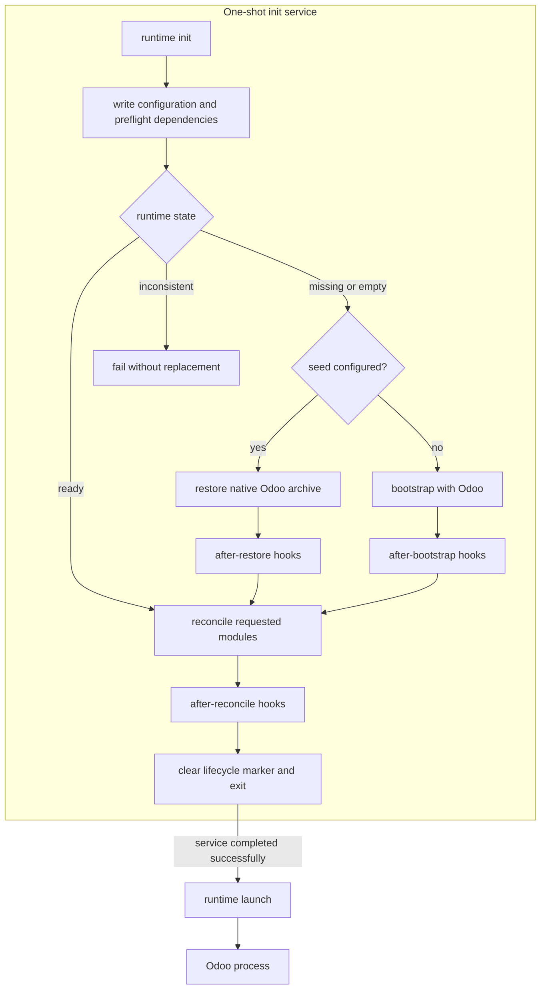

# Runtime lifecycle

A runtime is one PostgreSQL database and its matching filestore. gOdoo treats them as one unit and separates one-shot
initialization from the long-running Odoo process.

Explicit CLI options take precedence over process environment variables, which take precedence over project `.env`
defaults. A database target supplied through Compose remains the target when gOdoo loads project defaults.

## Public commands

- `godoo runtime init` prepares configuration and dependencies, selects restore, bootstrap, or reconciliation from the
  observed state, runs the matching hooks, and exits. `--update` and `--install` make module reconciliation explicit.
- `--report-url` (or `GODOO_REPORT_URL`) stores Odoo's `report.url` after successful initialization. It is required when
  `--x-sendfile` (or `GODOO_X_SENDFILE`) is enabled.
- `godoo runtime launch` starts Odoo without writing configuration or changing database state. It verifies the Odoo
  version and runs the additive Python dependency preflight required by the selected Odoo process.
- `godoo runtime status` inspects runtime and release state without writes.
- `godoo runtime shell` and `godoo runtime shell-script` run explicit Odoo shell sessions.
- `godoo db prepare` creates a database-and-filestore pair through CoW clone, PostgreSQL restore, native Odoo restore,
  or bootstrap. `godoo db backup`, `godoo db restore`, `godoo db clone`, and `godoo db reset` perform the corresponding
  explicit storage operations.

Bootstrap and reconciliation are phases of `runtime init`, not separate public runtime commands. Use
`godoo runtime --help` and `godoo db --help` for the current command surfaces.

## Initialization and hooks

Initialization belongs in a one-shot `init` service. The long-running `app` service runs `runtime launch` and depends on
initialization with `service_completed_successfully`. A configured seed never replaces a ready runtime. Direct CLI
callers must stop other application writers before initialization, reconciliation, replacement, or cloning; gOdoo
coordinates its own operations but does not stop downstream services.

Hook directories run in configured order. Their direct `*.py` files run in lexical order through separate Odoo shell
sessions. Lifecycle hook phases have at-least-once execution semantics: a failure or interruption leaves the phase
pending, and the complete phase runs again on the next `runtime init`. Every hook must be idempotent because scripts
that succeeded before a later failure can run again.

A missing or empty database with an existing nonempty filestore is inconsistent. Initialization leaves that data in
place and requires recovery of the matching pair. An initialized database may have no filestore directory when it has no
file-backed attachments. `runtime status` also treats unfinished lifecycle markers as inconsistent; dependency preflight
runs during initialization and launch.

## Locking and recovery

Initialization and storage operations hold per-database locks under the shared data directory's `.godoo/locks/`. Every
container managing the same runtime must mount the same data volume at its configured `data_dir`. Clones lock source and
target in a consistent order, and nested initialization and restore calls reuse their current locks. Lock files remain
after release; do not remove them while a process may be waiting. These locks coordinate gOdoo operations, not ordinary
Odoo application writes.

Lifecycle markers are lock-owned, versioned JSON records under `.godoo/pending-lifecycle/`. Before each phase, init
persists its `database`, selected `outcome`, and `pending_phase`; retries resume that phase and clear the marker only
after after-reconcile succeeds. A legacy, corrupt, or incompatible marker is unresolved recovery state: status reports
it inconsistent and init refuses to guess a phase.

`runtime status --json` reports a stable state and exit code: ready (0), missing (20), empty (21), inconsistent (22), or
unavailable (1). It reads production provenance from `/odoo/godoo-source-provenance.json`; `--provenance-path` overrides
that path. Production metadata identifies resolved source commits and addon archive content. Missing metadata does not
claim a release identity. Status does not create locks, change runtime state, or access the host source root.

The CLI forwards SIGTERM and SIGINT to the Odoo child process group and waits for shutdown, including during
initialization hooks. It preserves the child exit status and uses 128 plus the signal number for signal termination.
PostgreSQL restore subprocesses use the same handling so an interrupted restore can clean up its staging database before
releasing the runtime lock.

Native ZIP loads restore into a staging database through Odoo before replacing the target. SQL errors stop the restore;
failed loads leave the previous database and filestore in place. Native and legacy restores retain the previous database
until the filestore swap succeeds and roll back a failed swap. A marker under `.godoo/pending-restores/` records the
promotion interval. If the process is killed during that interval, status reports an inconsistent runtime and
initialization refuses to proceed. Inspect the database, filestore, retained backups, and marker before recovery; gOdoo
does not guess which copy to keep.

`db prepare` selects CoW cloning, a PostgreSQL archive restore, an Odoo archive restore, or a fresh bootstrap in that
order. Selection checks capabilities before changing the target; `--strategy` forces one method and fails early when
prerequisites are missing. Preparation leaves a marker under `.godoo/pending-lifecycle/`; `runtime init` clears it only
after dependency preflight, reconciliation, and hooks succeed.

Updating a source worktree does not migrate or roll back a database. Run module migrations explicitly through
`runtime init --update`, and retain matching database-and-filestore backups for release recovery.

Deployment-specific transport, proxy policy, module policy, hook contents, and service orchestration remain downstream
concerns. See [Downstream runtime setup](downstream.md) for the representative image and Compose contract.
